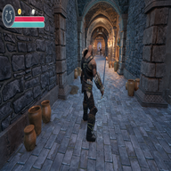

# Slash: An Epic Adventure Game



Welcome to **Slash**, an immersive and action-packed game development project built with Unreal Engine. This repository contains all the assets, configurations, and source code required to bring this epic adventure to life.

---

## 🌟 Features

- 🎨 **Stunning Visuals**: High-quality textures, materials, and VFX for a breathtaking experience.
- 🎮 **Dynamic Gameplay**: Interactive breakables, diverse characters, and challenging enemies.
- 🎵 **Rich Audio**: Immersive soundscapes, footsteps, and hit sounds for a realistic feel.
- 🌍 **Expansive World**: Open-world maps with detailed environments and hidden treasures.
- 🛠️ **Modular Design**: Organized blueprints, assets, and source code for easy scalability.

---

## 📂 Project Structure

Here's a quick overview of the project's structure:

- 📁 **Binaries/**: Compiled game binaries for Windows.
- 📁 **Config/**: Configuration files for engine, editor, and game settings.
- 📁 **Content/**: Game assets including blueprints, textures, meshes, and animations.
- 📁 **DerivedDataCache/**: Cached data for faster builds.
- 📁 **Intermediate/**: Temporary files generated during builds.
- 📁 **Saved/**: Autosaves, logs, and crash reports.
- 📁 **Source/**: C++ source code for the game and editor targets.

---

## 🚀 Getting Started

### Prerequisites

- 🛠️ Unreal Engine 5.x
- 💻 Visual Studio 2022 (or later)
- 🖥️ Windows 10/11

### Setup Instructions

1. Clone the repository:
   ```bash
   git clone <repository-url>
   ```
2. Open the `Slash.uproject` file in Unreal Engine.
3. Build the project using the Unreal Editor or Visual Studio.
4. Launch the game and start exploring!

---

## 🛠️ Development Highlights

### Key Assets

- 🧙‍♂️ **Characters**: Fully rigged and animated models with retargeted animations.
- 🗺️ **Maps**: Open-world and test maps for gameplay and debugging.
- 💥 **Destructibles**: Interactive pots, vases, and urns for dynamic gameplay.
- 🎧 **Audio**: High-quality sound effects for immersive gameplay.

### Blueprints

- 🎮 **GameMode**: Core gameplay logic and rules.
- 👾 **Enemy**: AI-driven enemy behavior and interactions.
- 🖥️ **HUD**: Heads-up display for player information.

---

## 🤝 Contributing

We welcome contributions to enhance the game! Feel free to submit pull requests or report issues.

---

## 📜 License

This project is licensed under the [MIT License](LICENSE).

---

Embark on an epic journey with **Slash** and unleash your creativity!